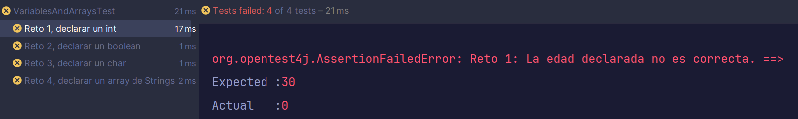

# RetoBit: API de Breaking Bad MVC 👨‍🔬

La API de Breaking ya está casi terminada. Solo falta hacer algunos tests de integración. Te han puesto a cargo de ello, ¡así que te toca hacer el bug hunt! (caza de bugs) 🕵️‍♂️

Puedes ejecutar el proyecto para ver cómo funciona la API y probar manualmente los endpoints con **postman**. La API está construida con Spring Boot y utiliza una base de datos en memoria para almacenar los personajes, así que **no hace falta que configures nada relativo a la base de datos**. Simplemente, ejecuta el proyecto y podrás probar los endpoints ya implementados con Postman usando el puerto `8080`.

### Endpoints

### `GET /api/characters`
Obtiene todos los personajes.

### `POST /api/characters`
Crea un nuevo personaje.

### `GET /api/characters/{id}`
Obtiene un personaje por su ID.

### `PATCH /api/characters/{id}/status`
Cambia el estado de un personaje a "Dead".

### `PUT /api/characters/{id}`
Actualiza un personaje por su ID.

**Añade el puerto `8080` a la URL de la API para probar los endpoints. Por ejemplo, si quieres probar el endpoint `GET /api/characters`, la URL completa sería `http://localhost:8080/api/characters`.*

## ¿Qué practicarás?

- Testing de integración con Spring Boot.
- MockMVC para simular el comportamiento de la API.

## Fork del repositorio:

Haz un fork del repo.

Pulsa el botón Fork en github:


Esto creará una copia del repositorio en tu perfil de Github.

## Clona el repo en tu computadora

Ahora hay que descargarse el proyecto en tu computadora.

### 1. Asegúrate de que estás en la URL de TU copia del repositorio


Si la URL es esta: https://github.com/curso-java-marshall-bits/retobit-API-breaking-bad-MVC **NO ES CORRECTO**.


Donde aparece 'curso-java-marshall-bits' debería aparecer tu nombre de usuario. Haz click en tu perfil y mira tus repositorios para comprobar si hiciste el fork. En caso contrario vuelve al paso anterior.


### 2. Pulsa en "code" para ver la URL del repositorio y cópiala


Para ello deberás abrir una terminal y navegar a la carpeta donde quieras añadir este retoBit.

Utiliza el siguiente comando:

```commandline
git clone https://aqui.debes.pegar.la.url
```

**Nota: Después del 'git clone' debes pegar la url del repositorio. No pongas la que he puesto yo en el ejemplo 🤣*

Ahora se va a crear un nuevo directorio con el nombre del retobit.

### 3. ¡Ya puedes abrir este reto en IntelliJ!

# Instrucciones

Tenemos implementados ya unos cuantos tests de integración. La funcionalidad de GET y la de POST ya están implementadas y funcionan correctamente. Tu tarea es implementar los tests de integración para los endpoints que faltan. 
Estos tests deberás añadirlos en el archivo `CharacterControllerTest` que ya incluye los otros dos tests vistos en las lecciones.

## Tarea 1: GET /api/characters/{id}
Implementa un test de integración para el endpoint `GET /api/characters/{id}`. Este test debe verificar que se puede obtener un personaje por su ID. El archivo `data.sql` crea automáticamente una tabla con estos personajes:

| ID | Nombre               | Ocupación             | Estado | Imagen                                      |
|----|----------------------|-----------------------|--------|---------------------------------------------|
| 1  | Walter White         | Profesor de Química   | ALIVE  | https://example.com/walter-white.jpg        |
| 2  | Jesse Pinkman        | Ex-estudiante         | ALIVE  | https://example.com/jesse-pinkman.jpg       |
| 3  | Skyler White         | Contable              | ALIVE  | https://example.com/skyler-white.jpg        |
| 4  | Hank Schrader        | Agente DEA            | ALIVE  | https://example.com/hank-schrader.jpg       |
| 5  | Marie Schrader       | Técnico Radiológico   | ALIVE  | https://example.com/marie-schrader.jpg      |
| 6  | Walter White Jr.     | Estudiante            | ALIVE  | https://example.com/walter-jr.jpg           |
| 7  | Saul Goodman         | Abogado               | ALIVE  | https://example.com/saul-goodman.jpg        |
| 8  | Mike Ehrmantraut     | Ex-policía            | ALIVE  | https://example.com/mike-ehrmantraut.jpg    |
| 9  | Gus Fring            | Empresario            | ALIVE  | https://example.com/gus-fring.jpg           |
| 10 | Tuco Salamanca       | Distribuidor          | ALIVE  | https://example.com/tuco-salamanca.jpg      |

Utiliza MockMVC para simular el comportamiento de la API y verificar que se puede obtener un personaje por su ID. 

Asegúrate de que el test verifica como mínimo lo siguiente:
- El endpoint devuelve un código de estado 200 (OK).
- El cuerpo de la respuesta contiene los datos del personaje con el ID solicitado.

## Tarea 2: PATCH /api/characters/{id}/status
Implementa un test de integración para el endpoint `PATCH /api/characters/{id}/status
`. 

Asegúrate de que el test verifica como mínimo lo siguiente:
- El endpoint devuelve un código de estado 200 (OK).
- El cuerpo de la respuesta contiene el personaje actualizado con el estado cambiado a "Dead".

## Tarea 3: PUT /api/characters/{id}
Implementa un test de integración para el endpoint `PUT /api/characters/{id}`.
Este test debe verificar que se puede actualizar un personaje por su ID. 

Asegúrate de que el test verifica como mínimo lo siguiente:
- El endpoint devuelve un código de estado 200 (OK).
- El cuerpo de la respuesta contiene el personaje actualizado con los nuevos datos.

## Ejecutar los tests

👁️ ¡Ojo! Este ejercicio se trata de que tú crees los tests de integración, así que puede que encuentres que la app tiene algunos errores y no pasa los tests que has hecho. ¡Esa es la grandeza del testing!


Puedes ejecutarlos todos a la vez con el botón derecho en el directorio **src/test/java** seleccionando la opción 'Run tests in Java' o en cada uno de los archivos de test.

El test te indicará si has pasado con un tick verde ✅. En caso contrario verás el error.

Ejemplo:



Pulsa en cualquiera de los tests que has fallado y mira el mensaje de la derecha.

- *Expected*: es el valor que el test estaba esperando.
- *Actual*: es el valor que tu reto está retornando.

## Solución

Si quieres ver una posible solución para el retoBit que pasa todos los tests puedes mirar la rama *solution* dentro del repositorio.


Ten en cuenta que hay muchas formas de resolver los ejercicios y la tuya puede pasar los tests iguales, pero ser completamente distinta a la solución. No significa que la tuya esté mal. Compara los resultados y decide cuál te gusta más o te parece más legible.

## Entrega

Realiza un commit con los cambios desde la terminal:

1. Añade todos los cambios
````commandline
git add .
````

2. Haz el commit con el mensaje
````commandline
git commit -m "retobit finalizado"
````

3. Haz un push
````commandline
git push origin main
````

Debes realizar una pull request para entregar el ejercicio. Abre el link del repositorio en github y haz click en la pestaña *pull requests*.

Selecciona *New pull request*, *Create pull request* y confírmala. Esto hará que yo pueda verlo y revisarlo en caso de que haya fallado algún test para poder darte feedback.

Mucha suerte con el reto. Te mando un abrazo y ¡Sigamos desarrollando! 🫂

[marshall-bits.dev](http://marshall-bits.dev)

*Nota: Estos retos pertenecen al curso de Marcel Bosch de Java para desarrolladores junior. Cualquier uso fuera de este contexto debe estar autorizado explícitamente. Si quieres usar estos ejercicios ponte en contacto conmigo a través de mis redes sociales (visita mi página para [más información](http://marshall-bits.dev)).*
